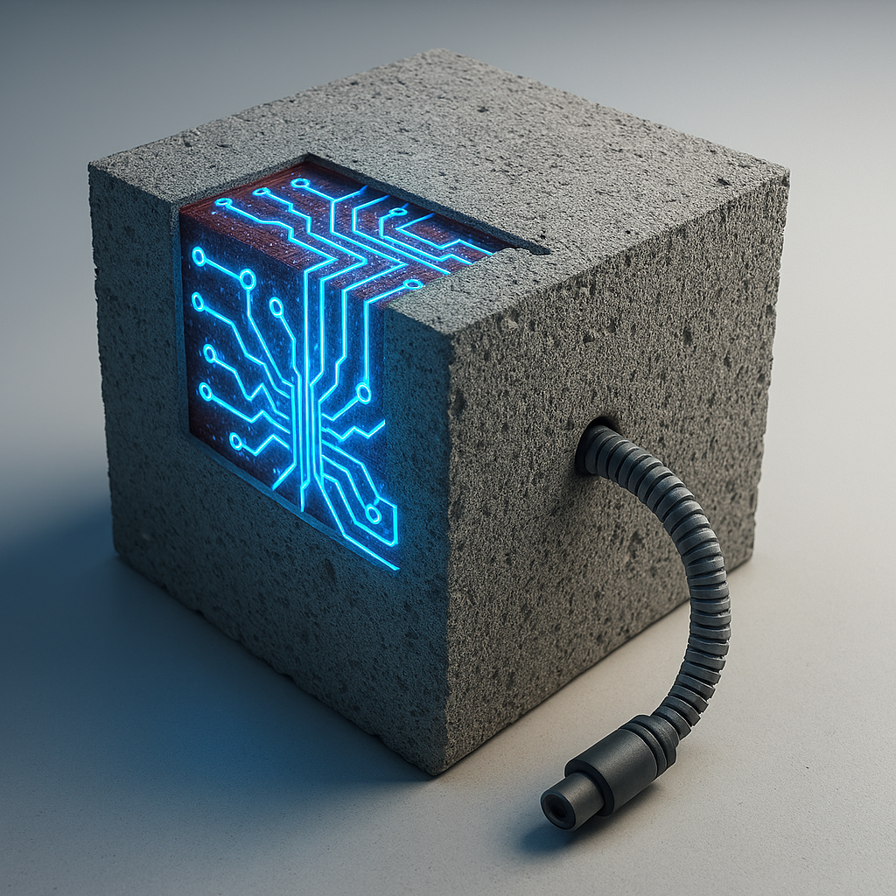

# climacrete-systems
[F25 Duke University AI Hackathon](https://duke-ai-hackathon-2025.devpost.com/project-gallery)

--

## 01_data_cleaning.ipynb
> The first is the UCI Concrete Compressive Strength dataset (a classic baseline for regression).
> The second is a research dataset with recycled aggregates, fibers, and SCMs — ideal for showcasing low-carbon or alternative materials.

--

## 02_training_strength_model.ipynb
> Train a regression model. Predict compressive strength (MPa) based on the cleaned mix design features

--
## Charts

