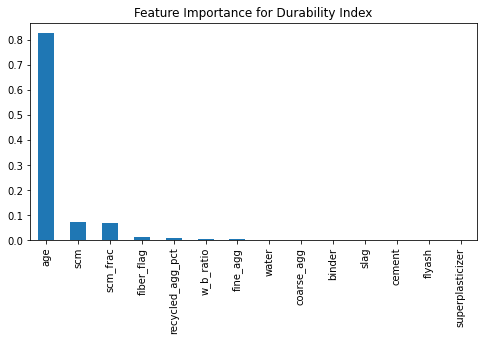
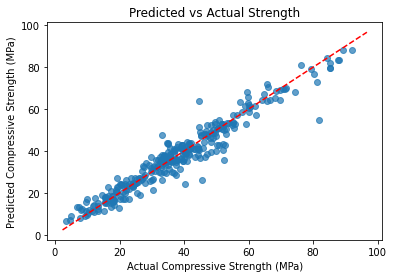

# climacrete-systems
F25 Duke University AI Hackathon


--

```
climacrete/
│
├── data/
│   ├── concrete_dataset.csv
│   └── carbon_factors.json
│
├── models/
│   ├── strength_model.pkl
│   └── durability_model.pkl
│
├── notebooks/
│   ├── 01_data_cleaning.ipynb
│   ├── 02_training_strength_model.ipynb
│   └── 03_training_durability_model.ipynb
│
├── app/
│   ├── app.py
│   ├── utils.py
│   └── report_generator.py
│
└── requirements.txt
```

--

## 01_data_cleaning.ipynb
> The first is the UCI Concrete Compressive Strength dataset (a classic baseline for regression).
> The second is a research dataset with recycled aggregates, fibers, and SCMs — ideal for showcasing low-carbon or alternative materials.

--

## 02_training_strength_model.ipynb
> Train a regression model. Predict compressive strength (MPa) based on the cleaned mix design features

--
## Charts

